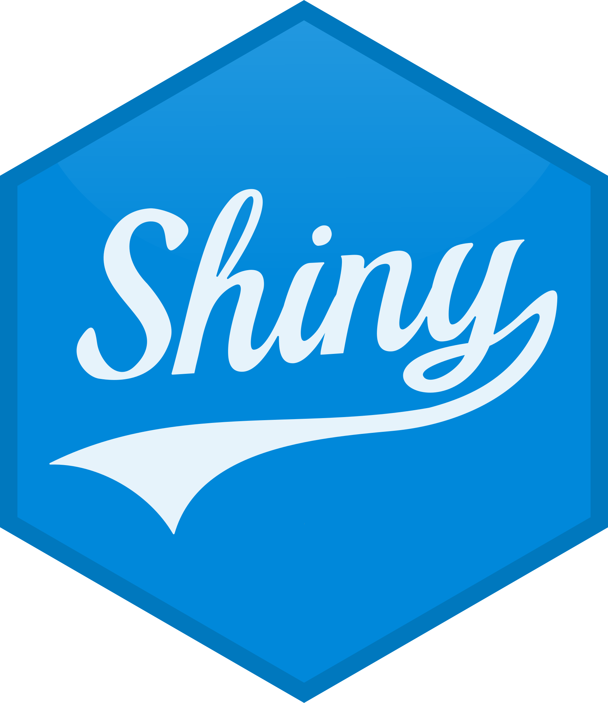

<h1 align="center">:wave: Hi, Thanks for Checking out my Github Profile!</h1>

<h3 align="center"> <b> I'm Max Vo, currently a Masters of Data Science in Health Student at UCLA! </b> </h3>

<h3 align="center">Languages I Love</h3>

  
  
  

<h3 align="center">Utils I Use</h3>

  
  
   
  
  
  
  

  
Click to expand

<!-- ICON BLOCK -->

